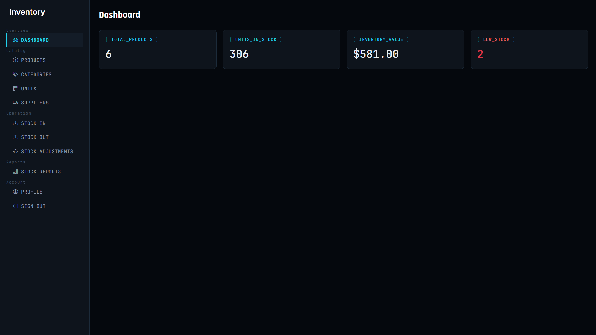
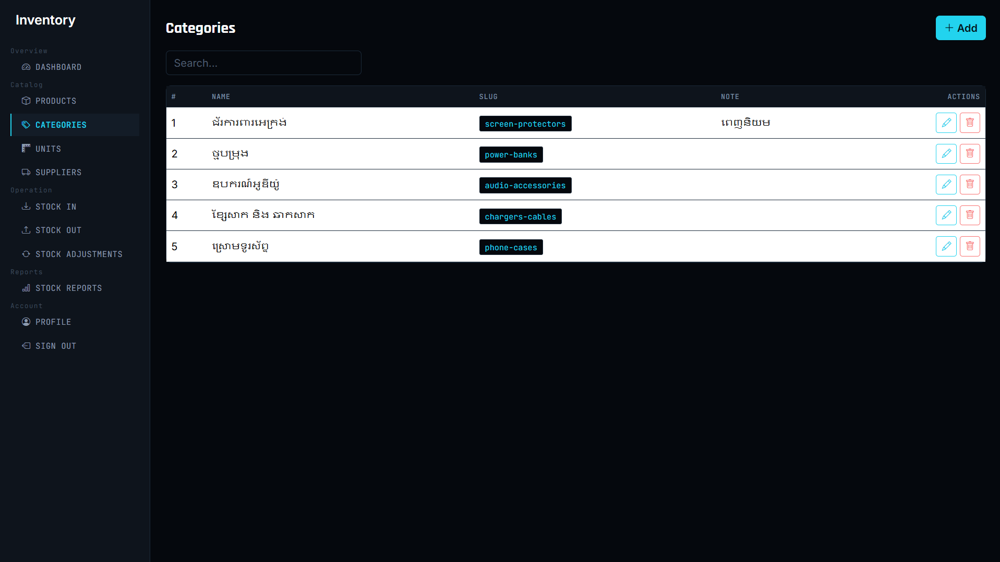
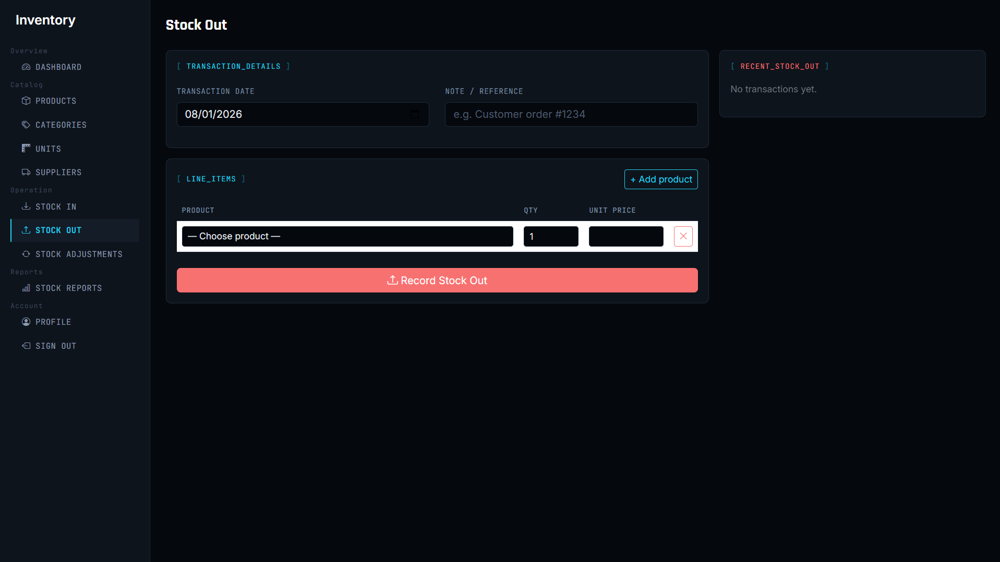
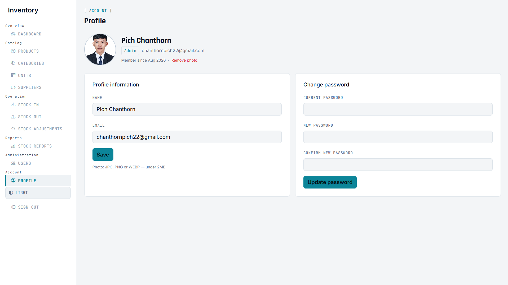
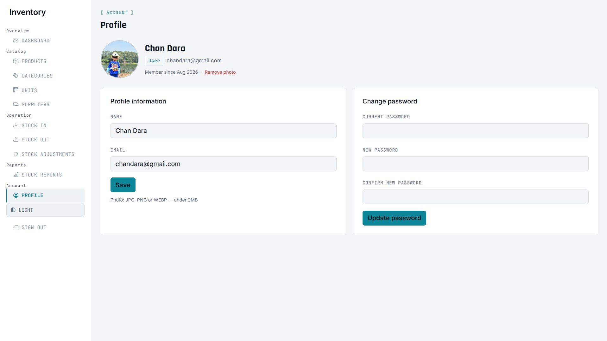

# 📦 Inventory Management System

A full-stack Inventory Management System for tracking products, stock movements, suppliers, and user roles — built with modern **PHP 8 (PDO)** and **MySQL**, using prepared statements throughout for SQL-injection safety.

---

## ✨ Features

- **Authentication:** Secure login and registration with bcrypt hashed passwords (`password_hash()` / `password_verify()`).
- **Dashboard:** Real-time metrics for total products, inventory valuation, stock units, and low-stock alerts.
- **Categories:** Full CRUD management with search and slug generation.
- **Products:** Product catalog with SKU, barcode, unit cost, selling price, auto-calculated profit margins, and min stock thresholds.
- **Suppliers:** Supplier directory with contact info, phone, email, and address tracking.
- **Units:** Measurement units management (pcs, box, set, pack, etc.).
- **Stock In:** Multi-line receiving receipts with automated stock addition inside atomic DB transactions.
- **Stock Out:** Multi-line dispatch form with live stock availability verification.
- **Stock Adjustment:** Direct inventory correction with mandatory audit reason logging.
- **Stock Reports:** Summary analytics, itemized transaction audit logs, and one-click CSV export.
- **User Management:** Admin portal to provision staff accounts and manage permissions.
- **Role Permissions:** Role-based access control (Admin, User, Viewer) with server-side protection on sensitive actions.
- **Dark / Light Theme:** Integrated theme switcher with client-side preference persistence.

---

## 🖼️ Screenshots

| Login | Dashboard |
|---|---|
|  |  |

| Categories | Products |
|---|---|
|  |  |

| Stock In | Stock Out |
|---|---|
|  |  |

| Stock Reports | Profile (Admin) |
|---|---|
|  |  |

| Profile (Staff) | User Management (Admin) |
|---|---|
|  |  |

---

## 📋 Requirements

- **PHP:** 8.0, 8.1, 8.2, or 8.3 (with `pdo` and `pdo_mysql` extensions enabled)
- **Database:** MySQL 8.x or MariaDB 10.x+
- **Web Server:** Apache (with `mod_rewrite`) or Nginx
- **Local Dev Environment:** XAMPP, Laragon, or Docker Compose

---

## 🔑 Demo Login Credentials

> [!WARNING]
> The following credentials are strictly for **DEVELOPMENT / DEMO / TESTING** purposes. Never use these default credentials in a production environment!

| Role | Email | Password | Notes |
|---|---|---|---|
| **Admin** | `admin@inventory.com` | `admin123` | Full admin privileges (forced password change on first login) |
| **Staff (User)** | `staff@inventory.com` | `user123` | Standard inventory operator privileges |

---

## 🚀 Installation & Setup

### Option A — Local Development with XAMPP

1. **Clone or Download the Repository:**
   ```bash
   cd C:\xampp\htdocs
   git clone https://github.com/YOUR_USERNAME/YOUR_REPOSITORY.git inventory-app
   ```
2. **Start Services:**
   Open the XAMPP Control Panel and start **Apache** and **MySQL**.
3. **Create Database:**
   - Open [http://localhost/phpmyadmin](http://localhost/phpmyadmin).
   - Create a database named `inventory_db`.
4. **Import Database Tables & Seed Data:**
   - In phpMyAdmin, select `inventory_db` → click **Import**.
   - Import `database/schema.sql` (creates all tables).
   - Import `database/seed.sql` (loads demo categories, products, and users).
5. **Configure Environment (Optional):**
   - Copy `.env.example` to `.env` if you need custom credentials:
     ```bash
     copy .env.example .env
     ```
   - Default XAMPP settings (`DB_HOST=127.0.0.1`, `DB_USER=root`, `DB_PASS=`) work out of the box with no changes required.
6. **Launch Application:**
   Open your browser and visit: `http://localhost/inventory-app/`

---

### Option B — Local Development with Laragon

1. **Clone the Repository:**
   ```bash
   cd C:\laragon\www
   git clone https://github.com/YOUR_USERNAME/YOUR_REPOSITORY.git inventory-app
   ```
2. **Start Laragon:**
   Click **Start All** in the Laragon panel.
3. **Import Database:**
   - Open HeidiSQL / Database manager via Laragon.
   - Create database `inventory_db`.
   - Run `database/schema.sql`, followed by `database/seed.sql`.
4. **Configure Environment:**
   - Copy `.env.example` to `.env` if custom MySQL password is configured.
5. **Access Application:**
   Visit: `http://inventory-app.test/` or `http://localhost/inventory-app/`

---

### Option C — Docker & Docker Compose (Quickest)

You can run the entire PHP + Nginx + MySQL stack with a single command:

1. **Start Containers:**
   ```bash
   docker compose up -d
   ```
   *(The database container automatically imports `database/schema.sql` and `database/seed.sql` on first boot).*
2. **Access the App:**
   Open [http://localhost:8080](http://localhost:8080) in your web browser.
3. **Stop Containers:**
   ```bash
   docker compose down
   ```

---

### Option D — Shared Hosting / cPanel

1. **Create MySQL Database & User:**
   - In cPanel, go to **MySQL Databases**.
   - Create a new database (e.g. `cpaneluser_inventory`).
   - Create a database user, assign a strong password, and grant **ALL PRIVILEGES**.
2. **Upload Files:**
   - Compress the project folder into a `.zip` (excluding any `.git` folder).
   - Upload and extract it into `public_html/` (or a subdomain directory).
3. **Import Database:**
   - In cPanel, open **phpMyAdmin**.
   - Select your newly created database and import `database/schema.sql`, then `database/seed.sql`.
4. **Configure `.env`:**
   - Create or edit `.env` in the root folder with your cPanel database details:
     ```env
     APP_ENV=production
     APP_DEBUG=false

     DB_HOST=localhost
     DB_PORT=3306
     DB_NAME=cpaneluser_inventory
     DB_USER=cpaneluser_dbuser
     DB_PASS=YourSecurePasswordHere
     ```
5. **Set PHP Version:**
   - In cPanel **Select PHP Version**, ensure PHP **8.1+** is selected with `pdo_mysql` extension enabled.
6. **Test Application:**
   - Visit your website domain or subdomain and log in with your Admin credentials.

---

### Option E — VPS Deployment (Ubuntu / Debian + Apache + MySQL)

1. **Update Server & Install Stack:**
   ```bash
   sudo apt update && sudo apt upgrade -y
   sudo apt install -y apache2 mysql-server php php-cli php-mysql php-mbstring git
   ```
2. **Configure MySQL:**
   ```bash
   sudo mysql -e "CREATE DATABASE inventory_db CHARACTER SET utf8mb4 COLLATE utf8mb4_unicode_ci;"
   sudo mysql -e "CREATE USER 'inventory_user'@'localhost' IDENTIFIED BY 'StrongPassword123!';"
   sudo mysql -e "GRANT ALL PRIVILEGES ON inventory_db.* TO 'inventory_user'@'localhost'; FLUSH PRIVILEGES;"
   ```
3. **Import Schema & Seed Data:**
   ```bash
   mysql -u inventory_user -p inventory_db < database/schema.sql
   mysql -u inventory_user -p inventory_db < database/seed.sql
   ```
4. **Deploy Application Code:**
   ```bash
   cd /var/www
   sudo git clone https://github.com/YOUR_USERNAME/YOUR_REPOSITORY.git inventory-app
   sudo chown -R www-data:www-data /var/www/inventory-app
   sudo chmod -R 755 /var/www/inventory-app
   sudo chmod -R 775 /var/www/inventory-app/uploads
   ```
5. **Configure Production Environment:**
   ```bash
   cd /var/www/inventory-app
   sudo cp .env.example .env
   sudo nano .env
   ```
   *(Update `DB_USER`, `DB_PASS`, `DB_NAME`, and set `APP_DEBUG=false`)*.
6. **Configure Apache Virtual Host:**
   ```apache
   <VirtualHost *:80>
       ServerAdmin webmaster@yourdomain.com
       DocumentRoot /var/www/inventory-app
       ServerName yourdomain.com

       <Directory /var/www/inventory-app>
           AllowOverride All
           Require all granted
       </Directory>

       ErrorLog ${APACHE_LOG_DIR}/inventory_error.log
       CustomLog ${APACHE_LOG_DIR}/inventory_access.log combined
   </VirtualHost>
   ```
7. **Enable Site & Restart Apache:**
   ```bash
   sudo a2enmod rewrite
   sudo a2ensite inventory-app.conf
   sudo systemctl restart apache2
   ```

---

## 🗄️ Database Architecture

```
roles                  (id, name)
users                  (id, name, email, password, role_id, avatar, must_change_password, created_at)
categories             (id, name, slug, note, created_at)
units                  (id, name, note)
suppliers              (id, name, phone, email, address, note)
products               (id, name, sku, barcode, category_id, supplier_id, unit_id, note, cost_price, sale_price, min_stock, current_stock, created_at)
stock_transactions     (id, reference, type, transaction_date, note, supplier_id, user_id, created_at)
stock_transaction_items(id, transaction_id, product_id, qty, unit_price, subtotal)
```

---

## 📂 Project Structure

```
inventory-app/
├── .github/workflows/     # CI/CD automation (PHP syntax linter)
├── assets/                # CSS stylesheet and logo assets
├── auth/                  # Authentication (login, register, logout)
├── category/              # Categories CRUD module
├── config/                # Database connection & URL resolution
├── database/              # MySQL schema and demo seed datasets
├── docker/                # Dockerfile and Nginx configurations
├── includes/              # Shared headers, footers, and auth guard
├── lang/                  # Localization (English & Khmer)
├── product/               # Products CRUD module
├── screenshots/           # Application screenshots for documentation
├── stock-adjustment/      # Direct stock adjustment module
├── stock-in/              # Stock receiving module
├── stock-out/             # Stock issuing module
├── stock-report/          # Audit reports and CSV export module
├── supplier/              # Suppliers CRUD module
├── unit/                  # Units CRUD module
├── uploads/               # Upload directories (avatars, products)
├── user/                  # Admin-only user management portal
├── .env.example           # Environment template
├── .gitignore             # Git ignore rules
├── docker-compose.yml     # Multi-container orchestration
├── LICENSE                # MIT License
├── profile.php            # User account profile and password change
├── dashboard.php          # Main analytics dashboard
└── index.php              # Entrypoint router
```

---

## 🛡️ Security Best Practices

- **PDO Prepared Statements:** All SQL queries use parameter binding to eliminate SQL injection risks.
- **Bcrypt Hashing:** Passwords are cryptographically hashed using standard PHP `password_hash()`.
- **Role-Based Guards:** Server-side `isAdmin()` verification prevents unauthorized API/URL tampering.
- **Input Sanitization:** User output is escaped via `htmlspecialchars()` to prevent XSS.
- **Upload Validation:** Uploaded profile photos are checked for MIME type and file size limits.
- **Environment Isolation:** Sensitive credentials reside in `.env` (ignored in version control).

---

## 📄 License

This project is licensed under the [MIT License](LICENSE).
